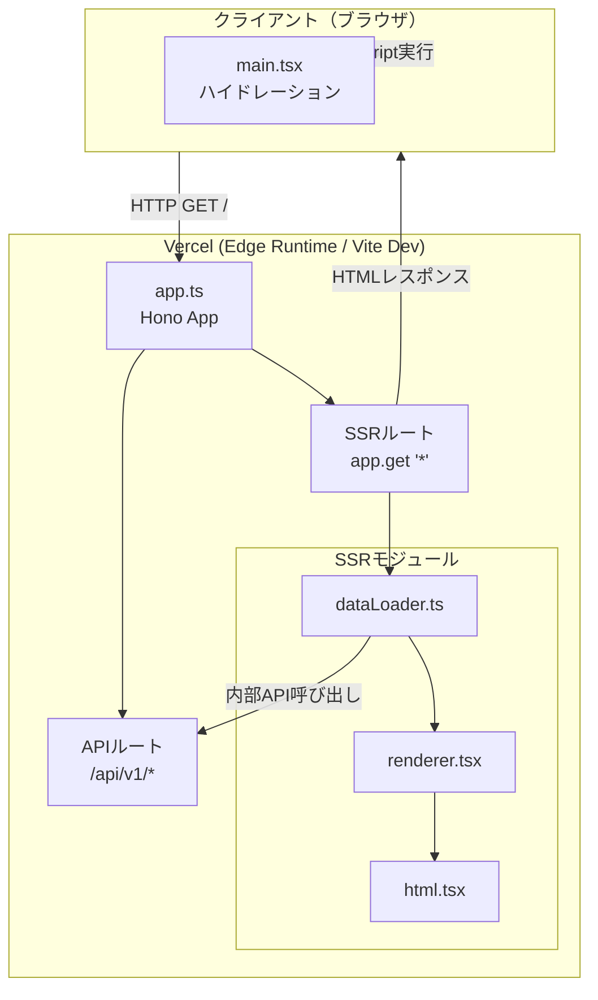

# SSRアーキテクチャ

HonoアプリケーションにSSR（Server-Side Rendering）機能を統合し、Vercel Edge Runtimeに最適化したアーキテクチャの設計ドキュメント。

## 概要

このアーキテクチャは、以下の目的を達成する：

- **SEO対応**: サーバー側でHTMLを生成し、検索エンジンがコンテンツをクロール可能に
- **初期表示の高速化**: 初期データをHTMLに埋め込み、クライアント側のローディング時間を短縮
- **Vercel標準への準拠**: `@hono/vite-dev-server` を使用した開発環境と、Vercel Edge Functions による本番環境の統合
- **オフライン対応の維持**: IndexedDBベースの機能を維持しつつSSRの利点を享受

## 用語

| 用語 | 説明 |
|------|------|
| SSR | Server-Side Rendering。サーバー側でReactコンポーネントをHTML文字列に変換 |
| ハイドレーション | SSRで生成されたHTMLにReactのイベントハンドラや状態を「注入」する処理 |
| Vite Dev Server | `@hono/vite-dev-server` によりHonoアプリをVite内で直接実行する開発モード |
| Edge Runtime | Vercelが提供する、Node.jsより軽量でグローバルな実行環境 |

---

## アーキテクチャ全体図



---

## ファイル構成

```
api/
└── index.ts            # Vercel Edge Functions エントリーポイント

src/api/
├── app.ts              # Honoアプリ定義（API + SSR）
├── routes/             # 各APIエンドポイント
└── ssr/
    ├── dataLoader.ts   # 初期データ取得ロジック
    ├── renderer.tsx    # React SSR レンダリング
    └── html.tsx        # HTML テンプレート

src/client/
├── main.tsx            # クライアントエントリー（ハイドレーション）
└── index.css           # グローバルスタイル
```

---

## 主要モジュールの責務

### 1. app.ts - Honoアプリケーション

**責務**: APIルートとSSRルートの統合、および環境に応じたアセット管理

- `@hono/vite-dev-server` のエントリーポイントとして機能
- `import.meta.env.PROD` を使用して、開発用（Vite）と本番用（ビルド済み）のアセットパスを自動的に切り替え
- APIルート（`/api/*`）とSSRルート（`app.get("*")`）を一つのインスタンスで管理

### 2. api/index.ts - Vercelハンドラ

**責務**: Vercel Edge Runtime へのアダプター

- `hono/vercel` の `handle` 関数を使用して、HonoアプリをEdge Functionsとして公開
- 全てのHTTPメソッド（GET, POST, etc.）をハンドリング

### 3. dataLoader.ts - 初期データローダー

**責務**: リクエストパスに応じた初期データのフェッチ

- `app.fetch()` を使用した内部API呼び出しにより、ネットワーク経由ではなくプロセス内でデータを取得
- SEOに必要なメタ情報や初期表示用の論文データを収集

### 4. renderer.tsx - SSRレンダラー

**責務**: ReactコンポーネントのHTML文字列化

- `react-dom/server` の `renderToString` を使用
- `window.__INITIAL_DATA__` へのデータ埋め込みを行い、クライアント側でのシームレスなハイドレーションを実現

---

## 開発と本番のフロー

### 開発環境

`pnpm dev` (Vite) を実行すると、以下のフローで動作する：

1. Viteが起動し、`@hono/vite-dev-server` プラグインが `src/api/app.ts` を読み込む
2. Honoアプリが3000番ポートで待機
3. ブラウザからのリクエストに対し、HonoがSSRを実行
4. アセットパスは `/src/client/main.tsx` のようなソースファイルパスを指し、ViteがオンデマンドでコンパイルとHMRを提供

### 本番環境（Vercel）

Vercelへのデプロイ時は以下のフローで動作する：

1. `vite build` により、クライアントアセットが `dist/assets/` に生成される
2. Vercelが `api/index.ts` を検出し、Edge Functionとしてデプロイ
3. `vercel.json` のリライト設定により、静的ファイル以外が `api/index.ts` へ送られる
4. `app.ts` は `import.meta.env.PROD` により、`dist/assets/` 配下のビルド済みファイルを指すようになる

---

## Vercel設定 (`vercel.json`)

Vercel標準のルーティング設定を使用。

```json
{
  "version": 2,
  "routes": [
    {
      "src": "/assets/(.*)",
      "headers": {
        "Cache-Control": "public, max-age=31536000, immutable"
      },
      "continue": true
    },
    {
      "src": "/(.*)",
      "dest": "/api/index.ts"
    }
  ]
}
```

---

## 改善された点（再構築の成果）

1. **認知負荷の低減**: 独自実装の `server.ts`（約140行）を廃止し、公式プラグインに移行
2. **型安全性の向上**: Viteによるサーバーサイドコードの処理により、環境変数の型補完などが容易に
3. **パフォーマンス**: Edge Runtime への移行により、コールドスタートの高速化とグローバルな低レイテンシを実現
4. **メンテナンス性**: Vercel と Hono の「標準」に沿った構成により、エコシステムの恩恵を最大限に享受可能
