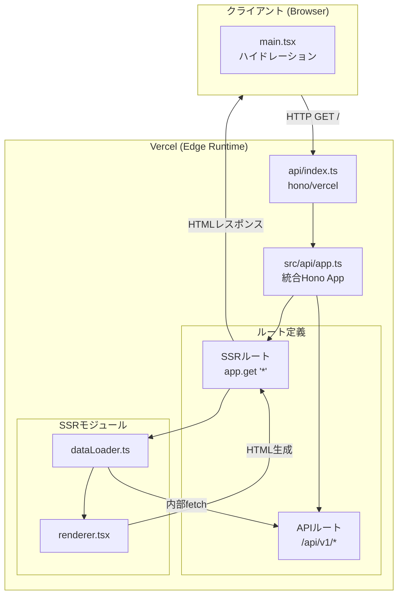

# SSRアーキテクチャ設計書

HonoアプリケーションにSSR（Server-Side Rendering）機能を統合し、Vercel Edge Runtimeに最適化したアーキテクチャの設計ドキュメント。

## 概要

このアーキテクチャは、認知負荷を最小限に抑えつつ、Vercel と Hono の「標準プラクティス」を最大限に活用することを目的とする。

- **SEO対応**: サーバー側でHTMLを生成し、検索エンジンがコンテンツを完全にクロール可能にする。
- **初期表示の高速化**: 初期データをHTMLに埋め込み、ハイドレーション時のラグを最小化する。
- **標準への準拠**: `@hono/vite-dev-server` による開発環境と、`hono/vercel` による本番環境をシームレスに統合する。
- **型安全な通信**: Hono RPC を使用し、クライアント・サーバー間でエンドツーエンドの型安全性を確保する。

## アーキテクチャ全体図



## ファイル構成

「基本形」に基づき、責務を明確に分離した構成。

```
api/
└── index.ts            # Vercel エントリーポイント（hono/vercel ハンドラ）

src/api/
├── app.ts              # Honoアプリ統合（Middleware / API / SSR）
├── routes/             # API v1 エンドポイント定義（プレフィックスなし）
└── ssr/                # SSRロジック（データ取得、レンダリング）

src/client/
├── main.tsx            # クライアントエントリー（ハイドレーション）
└── index.css           # グローバルスタイル
```

## 実装のポイント（実装の基本形）

### 1. エントリーポイントの最小化 (`api/index.ts`)

Vercel の仕様に基づき、ハンドラをエクスポートするだけの最小限のファイルにする。

```typescript
import { handle } from 'hono/vercel'
import app from '../src/api/app'

export const GET = handle(app)
export const POST = handle(app)
// ...
```

### 2. アプリケーションの階層化 (`src/api/app.ts`)

APIルートとSSRルートを分離し、認知負荷を下げる。

```typescript
const apiV1 = new Hono()
  .use('*', authMiddleware)
  .route('/search', searchApp)
  // ...

const app = new Hono()
  .use('*', logger())
  .route('/api/v1', apiV1)  // APIプレフィックスの一括付与
  .get('*', ssrHandler)     // それ以外はすべてSSR
```

### 3. 環境に応じたアセット管理

Vite の環境変数を使用し、開発環境と本番環境で読み込むスクリプトを自動的に切り替える。

```typescript
const isProd = import.meta.env.PROD
const assets = isProd 
  ? { js: ['/assets/index.js'], css: ['/assets/index.css'] }
  : { js: ['/src/client/main.tsx'], css: ['/src/client/index.css'] }
```

### 4. 内部フェッチによる初期データ取得 (`dataLoader.ts`)

SSR時に初期データを取得する際、ネットワーク経由ではなく `app.fetch(request)` を使用してプロセス内でAPIを呼び出す。これにより、型安全性を維持しつつパフォーマンスを向上させる。

## 開発と本番のフロー

1. **開発**: `pnpm dev` (Vite) により、`@hono/vite-dev-server` が `app.ts` を読み込み、HMR と SSR を同時に提供。
2. **ビルド**: `vite build` でクライアントアセットを生成。
3. **本番**: Vercel が `api/index.ts` を検出し、Edge Function としてデプロイ。`vercel.json` のリライトにより全リクエストが Hono へ送られる。

## 成果

- **一貫性**: 開発と本番で同一の Hono インスタンスが動作。
- **保守性**: ルート定義が階層化され、変更の影響範囲が明確。
- **速度**: Edge Runtime への最適化により、グローバルな低レイテンシを実現。
