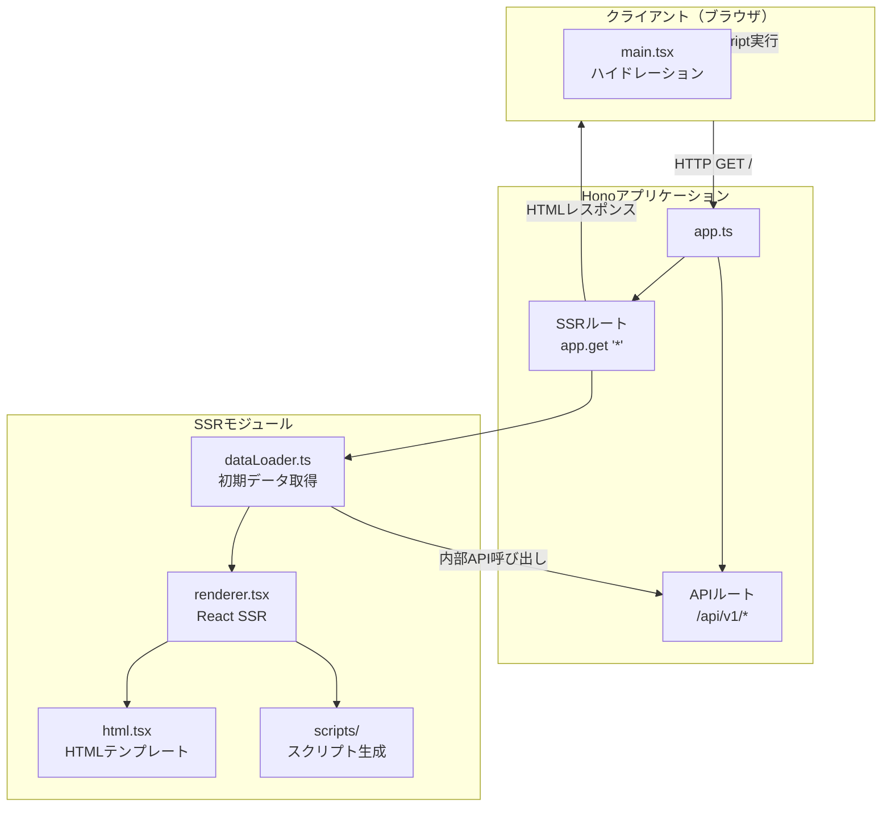
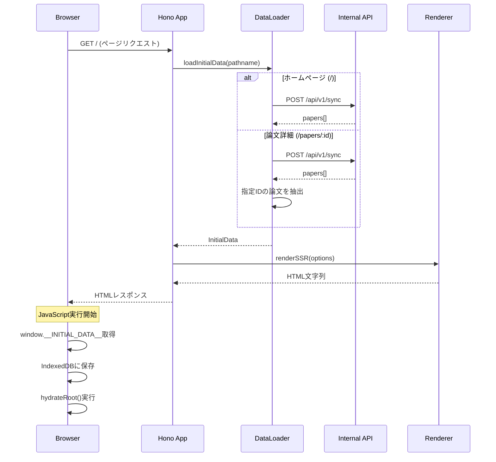
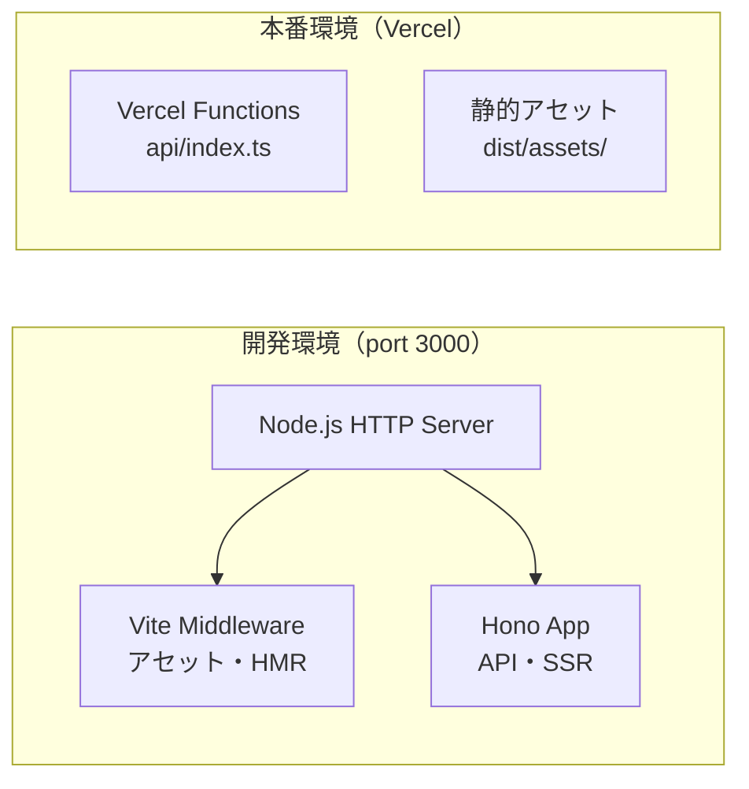

# SSRアーキテクチャ

HonoアプリケーションにSSR（Server-Side Rendering）機能を統合したアーキテクチャの設計ドキュメント。

## 概要

このアーキテクチャは、以下の目的を達成する：

- **SEO対応**: サーバー側でHTMLを生成し、検索エンジンがコンテンツをクロール可能に
- **初期表示の高速化**: 初期データをHTMLに埋め込み、クライアント側のローディング時間を短縮
- **オフライン対応の維持**: IndexedDBベースの機能を維持しつつSSRの利点を享受

## 用語

| 用語 | 説明 |
|------|------|
| SSR | Server-Side Rendering。サーバー側でReactコンポーネントをHTML文字列に変換 |
| ハイドレーション | SSRで生成されたHTMLにReactのイベントハンドラや状態を「注入」する処理 |
| Viteミドルウェアモード | ViteをHonoなどのサーバーにミドルウェアとして統合する動作モード |

---

## アーキテクチャ全体図



---

## ファイル構成

```
src/api/
├── app.ts              # Honoアプリ（APIルート + SSRルート）
├── server.ts           # 開発サーバー（Viteミドルウェアモード）
└── ssr/
    ├── dataLoader.ts   # 初期データ取得 + InitialData型定義
    ├── renderer.tsx    # ReactコンポーネントをHTML文字列に変換
    ├── html.tsx        # HTMLテンプレート
    └── scripts/
        ├── index.ts        # エクスポート集約
        ├── preamble.ts     # React Fast Refresh（開発環境のみ）
        ├── initialData.ts  # window.__INITIAL_DATA__埋め込み
        └── debug.ts        # デバッグ情報収集

src/client/
├── main.tsx                        # エントリーポイント（ハイドレーション）
└── components/
    └── ClientOnlyToaster.tsx       # SSR回避用ラッパー

api/
└── index.ts            # Vercel Functions用エントリーポイント
```

---

## データフロー

### リクエスト処理フロー



### 初期データの型定義

```typescript
// src/api/ssr/dataLoader.ts
interface InitialData {
  papers?: Paper[];      // ホームページ用: 論文一覧
  paper?: Paper;         // 論文詳細ページ用: 個別論文
  summary?: PaperSummary; // サマリー（クライアント側で生成）
}
```

---

## 主要モジュールの責務

### 1. app.ts - Honoアプリケーション

**責務**: Honoアプリの構築とSSRルートの定義

```typescript
interface CreateAppOptions {
  assets?: SSRRenderOptions["assets"];
}

createApp(options?: CreateAppOptions): Hono
```

- APIルートとSSRルートを統合
- SSRルート（`app.get("*")`）でAPI・アセット以外のすべてのリクエストを処理
- アセットパスを外部から注入可能（開発/本番で切り替え）

### 2. server.ts - 開発サーバー

**責務**: Viteミドルウェアモードを使用した統合開発サーバー

- `.env` / `.env.local` の読み込み
- Node.js HTTP ServerでViteとHonoを統合
- Viteがアセット配信とHMRを担当
- Honoが API と SSR を担当

### 3. dataLoader.ts - 初期データローダー

**責務**: ルートに応じた初期データの取得

```typescript
loadInitialData(app: AppType, c: Context, pathname: string): Promise<InitialData>
```

- `app.fetch()`を使用した内部API呼び出し
- Basic認証による内部リクエストの保護
- エラー時は空データを返してフォールバック

**デフォルト設定**:

```typescript
const DEFAULT_CATEGORIES = ["cs.AI", "cs.LG", "cs.CL", "stat.ML"];
const DEFAULT_SYNC_PERIOD_DAYS = 7;
```

### 4. renderer.tsx - SSRレンダラー

**責務**: ReactアプリをHTML文字列にレンダリング

```typescript
renderSSR(options: SSRRenderOptions): string
```

**処理フロー**:

1. `renderToString()`でReactコンポーネントをHTML化
2. HTMLテンプレートを生成
3. 初期データスクリプトを埋め込み
4. 開発環境用のpreambleスクリプトを埋め込み
5. デバッグスクリプトを埋め込み

### 5. html.tsx - HTMLテンプレート

**責務**: SSR用のHTML基本構造を定義

```typescript
HtmlTemplate(props: HtmlTemplateProps): JSX.Element
```

- `<html>`, `<head>`, `<body>`の基本構造
- メタタグ、フォント、アセット（CSS/JS）の読み込み
- `<div id="root">`コンテナ

### 6. scripts/ - スクリプト生成

| ファイル | 目的 | 本番環境 |
|----------|------|----------|
| `preamble.ts` | React Fast Refresh（HMR）対応 | 空文字列 |
| `initialData.ts` | `window.__INITIAL_DATA__`にデータ埋め込み | 有効 |
| `debug.ts` | スクリプトタグの確認、エラー監視 | 削除推奨 |

### 7. main.tsx - クライアントエントリーポイント

**責務**: クライアント側のアプリ起動とハイドレーション

**処理フロー**:

1. `window.__INITIAL_DATA__`から初期データを取得
2. 各Zustandストアの初期化（IndexedDBからの復元）
3. 初期データをIndexedDBに保存
4. SSRされたHTMLがある場合は`hydrateRoot()`、ない場合は`createRoot()`

```typescript
// SSRコンテンツの判定
const hasSSRContent = rootElement.children.length > 0;
```

### 8. ClientOnlyToaster.tsx - クライアント専用コンポーネント

**責務**: SSR環境でのハイドレーションエラーを回避

- `useState`と`useEffect`でマウント後にのみレンダリング
- SSR環境では`null`を返す

---

## 開発環境と本番環境の違い

### サーバー構成



### アセット配信

| 環境 | CSS | JavaScript |
|------|-----|------------|
| 開発 | `/src/client/index.css` | `/src/client/main.tsx` |
| 本番 | `/assets/index.css` | `/assets/index.js` |

### 起動コマンド

- **開発**: `pnpm dev`（1コマンドで全機能が起動）
- **本番**: Vercelにデプロイ

---

## Vercel設定

Vercel標準のrewrites設定を使用し、Edge Functionsで動作する。

### ビルドフロー

```
vite build    → dist/assets/（静的ファイル）
tsup          → api/index.js（Edge Function）
```

### src/api/vercel-entry.ts

```typescript
import { handle } from "hono/vercel";
import { createApp } from "./app.js";

// Edge Functions 設定
export const config = {
  runtime: "edge",
};

const app = createApp();

export const GET = handle(app);
export const POST = handle(app);
export const PUT = handle(app);
export const DELETE = handle(app);
export const PATCH = handle(app);
```

### vercel.json

```json
{
  "rewrites": [
    { "source": "/(.*)", "destination": "/api" }
  ]
}
```

Vercelは`dist/`の静的ファイルを優先配信するため、`/assets/*`の除外設定は不要。

### ルーティング優先順位

1. `dist/assets/*` → 静的ファイル（Viteビルド出力）
2. `/(.*)`（その他）→ Edge Function（SSR/API）

---

## エラーハンドリング

### SSRレンダリングエラー

```typescript
try {
  const html = renderSSR({ pathname, initialData, assets });
  return c.html(html);
} catch (error) {
  // エラー時は空のHTMLを返し、クライアント側でレンダリング
  const html = renderSSR({ pathname, assets });
  return c.html(html);
}
```

### データ取得エラー

```typescript
try {
  const data = await loadHomePageData(app, c);
  return { papers: data.papers ?? [] };
} catch (error) {
  // エラー時は空データを返してフォールバック
  return { papers: [] };
}
```

---

## セキュリティ考慮事項

### 内部API呼び出し

- Basic認証で内部リクエストを保護
- 環境変数から認証情報を取得（`BASIC_AUTH_USERNAME`, `BASIC_AUTH_PASSWORD`）
- デフォルト値は `admin:admin`（本番環境では必ず変更すること）

### スクリプトインジェクション対策

- `JSON.stringify()`で初期データを安全にエスケープ
- `dangerouslySetInnerHTML`は使用せず、文字列操作でHTMLを構築

---

## パフォーマンス考慮事項

### 初期データ取得

- ホームページではデフォルト設定で同期を実行（最大50件）
- 論文詳細ページでは一覧から該当論文を抽出
- サマリーはクライアント側で生成（APIキーが必要なため）

### オブジェクトの再利用

- アセットオブジェクトは一度だけ作成して再利用
- セキュリティヘッダーは`Object.freeze`で不変化

### キャッシュ戦略

- React Queryの`staleTime`を5分に設定
- サーバー側でも同じQueryClient設定を使用

---

## Vercel環境での注意点

### 実行時間制限

| プラン | 制限 |
|--------|------|
| Hobby | 10秒 |
| Pro | 60秒 |

初期データ取得（arXiv API + Embedding生成）が制限内に完了するか確認が必要。

### 推奨される改善

1. **タイムアウト処理の追加**

```typescript
const controller = new AbortController();
const timeoutId = setTimeout(() => controller.abort(), 8000);
```

2. **キャッシュ戦略の導入** - Vercel Edge ConfigやRedisでキャッシュ

3. **パフォーマンスモニタリング** - Vercel AnalyticsでSSR実行時間を監視

---

## デプロイチェックリスト

- [ ] 環境変数（`BASIC_AUTH_USERNAME`, `BASIC_AUTH_PASSWORD`）が設定されているか
- [ ] ビルドが成功し、`dist/assets/`にアセットが生成されているか
- [ ] SSRルート（`/`）が正しく動作するか
- [ ] 内部API呼び出しが正常に動作するか
- [ ] アセット（CSS/JS）が正しく読み込まれるか
- [ ] 実行時間が制限内に収まっているか

---

## 今後の改善点

1. **サマリーのSSR対応**: APIキーを環境変数で管理し、サーバー側でも生成
2. **キャッシュ戦略**: Redis等で初期データをキャッシュ
3. **ストリーミングSSR**: React 18のストリーミングSSRを活用
4. **エラーバウンダリー**: SSRエラー時のフォールバックUI改善
5. **デバッグスクリプトの条件付き出力**: 本番環境では無効化
