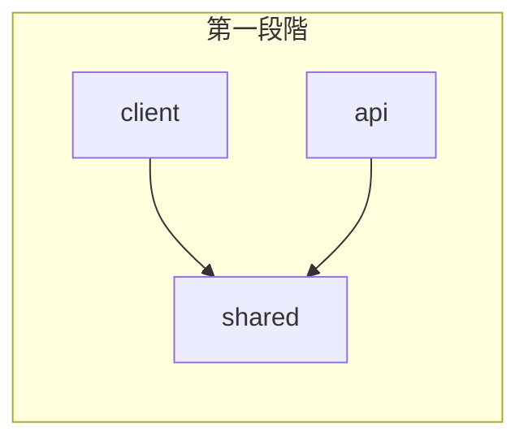
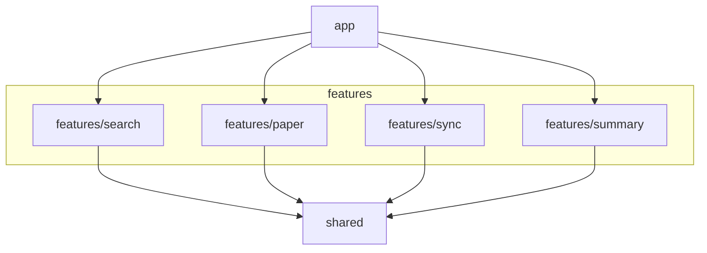
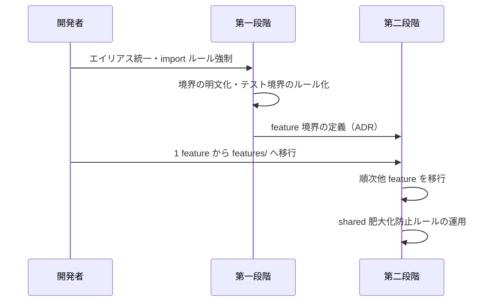

# lumina プロジェクト構造リファクタ デザインドキュメント

## 1. 概要

lumina のプロジェクト構造を現状の 70 点から 100 点に引き上げるため、境界・import の整備（第一段階）と Feature-sliced 構造への段階移行（第二段階）を採用する。承認されれば具体的なタスクに分解して実装に着手し、却下されれば現状維持または別案（レイヤード・モノレポ）を再検討する。

## 2. 背景と目標（WHY）

### 解決したい問題

- 変更の影響範囲が読みにくく、shared の修正が api と client の両方に波及することが分かりづらい。
- 相対 import（`../../shared`）の多用により、ファイル移動時の修正コストが高く、認知負荷が増えている。
- 機能追加・修正が client 配下の components / hooks / stores 等に分散し、変更局所化ができていない。

### 目標（GSMフレームワーク）

- **Goal**: 保守性・認知負荷・変更局所化を高めたプロジェクト構造を確立し、新機能追加や修正が安全に・迷わず行えるようにする。
- **Signal**: 新メンバーが「どこに何があるか」を短時間で把握できる。1 機能の変更が 1 スライス（feature）内に集約されている。
- **Metric**: 相対 import の排除率 100％。shared / api / client（および将来的に features/*）の責務と依存方向がドキュメント化され、import ルールがツールで強制されている。

## 3. 目標としないこと（Non-Goals）

- モノレポ（packages 分離）の即時導入。スケール要件が明確になるまで検討しない。
- 既存テストの全面的な書き換え。境界の明確化とルール化を優先し、テストは必要最小限の修正に留める。
- UI/UX や API 仕様の変更。本設計はディレクトリ・import・責務の分離に限定する。
- レイヤードアーキテクチャ（domain / application / infrastructure / presentation）への全面移行。採用案からは見送る。

## 4. 提案する設計（HOW）

### アーキテクチャ概要

**第一段階（現状＋微改善）**: shared / api / client の 3 区分を維持し、依存方向を明文化してツールで強制する。

**第二段階（Feature-sliced 目標構造）**: 機能ごとにスライスを切り、横断は shared に集約する。

### ディレクトリ・責務

| 区分 | 責務 | 依存してよいもの |
|------|------|------------------|
| shared | スキーマ（Zod）・日付等のユーティリティ | なし |
| api | Hono ルート・サービス・ミドルウェア | shared のみ |
| client | React コンポーネント・hooks・stores・DB・ページ | shared のみ（api は HTTP 経由のみ） |
| features/*（第二段階） | 1 機能に紐づく api + client のコード | shared のみ |

### 処理フロー（移行の流れ）

## 5. 検討した代替案

| 案 | 概要 | 利点 | 欠点 | 採用しなかった理由 |
|----|------|------|------|-------------------|
| A 現状＋微改善 | shared/api/client を維持し、命名・import ルール・境界の明文化のみ整理 | リスク低、着手が早い、認知負荷・テスト・オンボーディングで適合 | 保守性・スケーラビリティは partial、ルール強制が conditional | **第一段階として採用**。単独では 100 点に届かないため、C への橋渡しとする |
| B レイヤード | domain / application / infrastructure / presentation で分割、依存を一方向に | 依存方向が明確、テスト境界が取りやすい | 変更が複数レイヤに分散する。「変更はレイヤ内で完結」の仮定が invalid | 変更局所化が弱く、高重みの評価基準を満たしにくい |
| C Feature-sliced | features/search, paper, sync, summary と shared, app で縦割り | 保守性・変更局所化で有利。1 機能＝1 スライスで波及が少ない | feature 境界の安定と shared 肥大化防止に依存。認知負荷・スケーラビリティは partial | **第二段階の目標として採用**。A の後に段階移行する |
| D モノレポ分離 | packages/web, packages/api, packages/shared に物理分離 | 境界が明確、スケーラビリティで有利 | 移行コスト大。shared 変更が web/api 両方に波及する点は変わらない | 複数チーム・別デプロイ単位が明確になってから検討する |

## 6. 横断的関心事

### テスト戦略

- **ユニット**: 各スライス（shared / api / client、将来は features/*）内で完結。他スライスはモックまたは型のみ参照。
- **統合**: api テストは api + shared のみ依存。client テストは client + shared のみ依存。E2E は現行のまま Vitest + jsdom。移行時はテスト境界ルールを README または docs に明記する。
- **境界**: 「client が api を直接 import しない」をルール化し、Biome/ESLint で検知する。

### 監視・可観測性

- 本設計はディレクトリ・import の変更のため、ログ・メトリクス・アラートの方針は現状維持とする。変更なし。

### セキュリティ・プライバシー

- 構造変更により認証・API キー等の扱いが変わることはない。現状のセキュリティ方針を維持する。

### 移行・廃止計画

- **第一段階**: 相対 import を `@/shared` 等のエイリアスに置換。Biome/ESLint で import ルールを追加。shared / api / client の責務と依存方向を docs に記載。既存テストは必要最小限のパス修正のみ。
- **第二段階**: feature 境界を ADR で定義後、1 feature（例: search）から順に `features/` へ移行。shared への追加はレビュー付きとし、型・スキーマ中心に限定して肥大化を防ぐ。
- **ロールバック**: 各段階はコミット単位で切り戻し可能。Feature-sliced 移行は 1 スライスずつ進めるため、問題があれば該当スライスのみ戻す。

## 7. 未解決の質問

- [ ] feature の境界を search / paper / sync / summary で十分とするか、さらに細かく切るか（例: categories, settings）。
- [ ] エイリアスは `@/shared` / `@/api` / `@/client` のままとするか、`@shared` のように @ のみにするか（tsconfig / Vite の慣習に合わせる）。
- [ ] shared 肥大化防止の「レビュー」を PR テンプレートでどう強制するか（ラベル・必須レビュー項目の有無）。

## 8. 参考資料

- 設計案（A〜D）の比較・採用理由は思考オーケストレーターによる多角的判断で議論済み。本ドキュメントの「5. 検討した代替案」に要約を記載。

---

## タスクブレイクダウン

### タスク一覧

| # | タスク名 | 概要 | 見積もり | 先行タスク | ブランチ |
|---|----------|------|----------|------------|----------|
| T0 | Design Docs PR | タスクブレイクダウン情報の追加 | S | — | `feature/structure-refactor/00-design-docs` |
| T1 | エイリアス設定 | vite.config.ts / tsconfig.json に `@/shared` `@/api` `@/client` を定義 | S | T0 | `feature/structure-refactor/01-alias-config` |
| T2 | api・shared の import 置換 | api 配下および shared 内の相対 import をエイリアスに置換 | M | T1 | `feature/structure-refactor/02-api-shared-imports` |
| T3 | client の import 置換 | client 配下の相対 import をエイリアスに置換 | L | T2 | `feature/structure-refactor/03-client-imports` |
| T4 | import ルールのツール強制 | Biome または ESLint で相対 import 禁止・エイリアス優先を強制 | S | T3 | `feature/structure-refactor/04-import-lint-rules` |
| T5 | 境界ドキュメント | shared / api / client の責務・依存方向を docs に明文化 | S | T4 | `feature/structure-refactor/05-boundary-docs` |
| T6 | テスト境界のルール化 | api は api+shared、client は client+shared のみ依存とするルールを docs（＋必要なら CI）に記載 | S | T5 | `feature/structure-refactor/06-test-boundary-rules` |
| T7 | feature 境界 ADR | search / paper / sync / summary の境界と features/ のルールを ADR で定義 | M | T6 | `feature/structure-refactor/07-feature-boundary-adr` |
| T8 | 1 feature 移行（search） | features/search を新設し、search 関連の api・client コードを移行 | L | T7 | `feature/structure-refactor/08-feature-search-migrate` |
| T9 | 残り feature の移行 | paper / sync / summary を features/ へ順次移行 | L | T8 | `feature/structure-refactor/09-remaining-features-migrate` |
| T10 | shared 肥大化防止ルール | shared 追加のレビュー方針・型・スキーマ中心のルールを doc 化 | S | T9 | `feature/structure-refactor/10-shared-bloat-prevention` |
| T11 | 認知負荷の点検 | 上記変更を反映したドキュメント更新・点検 | S | T10 | `feature/structure-refactor/11-cognitive-load-check` |

**注**: T9 で PR 差分が 300 行超となる場合は、09a paper / 09b sync / 09c summary に分割する。

### 依存関係図（スタック方式）

```mermaid
graph LR
    T0[Design Docs PR] --> T1[エイリアス設定]
    T1 --> T2[api shared import]
    T2 --> T3[client import]
    T3 --> T4[importルール強制]
    T4 --> T5[境界ドキュメント]
    T5 --> T6[テスト境界ルール]
    T6 --> T7[feature境界ADR]
    T7 --> T8[1feature移行 search]
    T8 --> T9[残りfeature移行]
    T9 --> T10[shared肥大化防止]
    T10 --> T11[認知負荷点検]
```

### ブランチ戦略

| ブランチ | 親 | マージ順 | 備考 |
|----------|-----|----------|------|
| `feature/structure-refactor/00-design-docs` | `main` | 0 | Design Docs PR（設計レビュー用） |
| `feature/structure-refactor/01-alias-config` | `/00-design-docs` | 1 | |
| `feature/structure-refactor/02-api-shared-imports` | `/01-alias-config` | 2 | |
| `feature/structure-refactor/03-client-imports` | `/02-api-shared-imports` | 3 | |
| `feature/structure-refactor/04-import-lint-rules` | `/03-client-imports` | 4 | |
| `feature/structure-refactor/05-boundary-docs` | `/04-import-lint-rules` | 5 | |
| `feature/structure-refactor/06-test-boundary-rules` | `/05-boundary-docs` | 6 | |
| `feature/structure-refactor/07-feature-boundary-adr` | `/06-test-boundary-rules` | 7 | |
| `feature/structure-refactor/08-feature-search-migrate` | `/07-feature-boundary-adr` | 8 | |
| `feature/structure-refactor/09-remaining-features-migrate` | `/08-feature-search-migrate` | 9 | |
| `feature/structure-refactor/10-shared-bloat-prevention` | `/09-remaining-features-migrate` | 10 | |
| `feature/structure-refactor/11-cognitive-load-check` | `/10-shared-bloat-prevention` | 11 | |

**整合性チェック**: 各タスクの先行タスクと、そのブランチの親が対応していることを確認済み（T1 の先行 T0 → `/01` の親 `/00`、以降同様）。

### 見積もりサマリー

- 総タスク数: 12（T0〜T11）
- S（小）: 8
- M（中）: 2
- L（大）: 2

---

## 更新履歴

| 日付 | 変更内容 | 理由 |
|------|----------|------|
| 2025-03-02 | 初版作成 | Design Docs スキルに基づく作成 |
| 2025-03-02 | タスクブレイクダウン追記 | task-breakdown スキルで分解・ブランチ戦略を策定 |

---

## セルフレビュー結果（evaluate.md チェックリスト）

| カテゴリ | スコア | 判定 |
|----------|--------|------|
| 必須項目 | 5/5 | レビュー可 |
| 品質項目 | 4/5 | 合格 |
| 横断的関心事 | 4/4 | 本番Ready |

- **必須**: GSM・Non-Goals・アーキテクチャ図・代替案4案・棄却理由を記載済み。
- **品質**: 概要・根拠・スケール検討・意図しない依存の防止（import ルール）を記載。長期視点は移行計画で補足。
- **横断**: テスト戦略・監視（現状維持）・セキュリティ（現状維持）・移行・廃止計画を記載。
