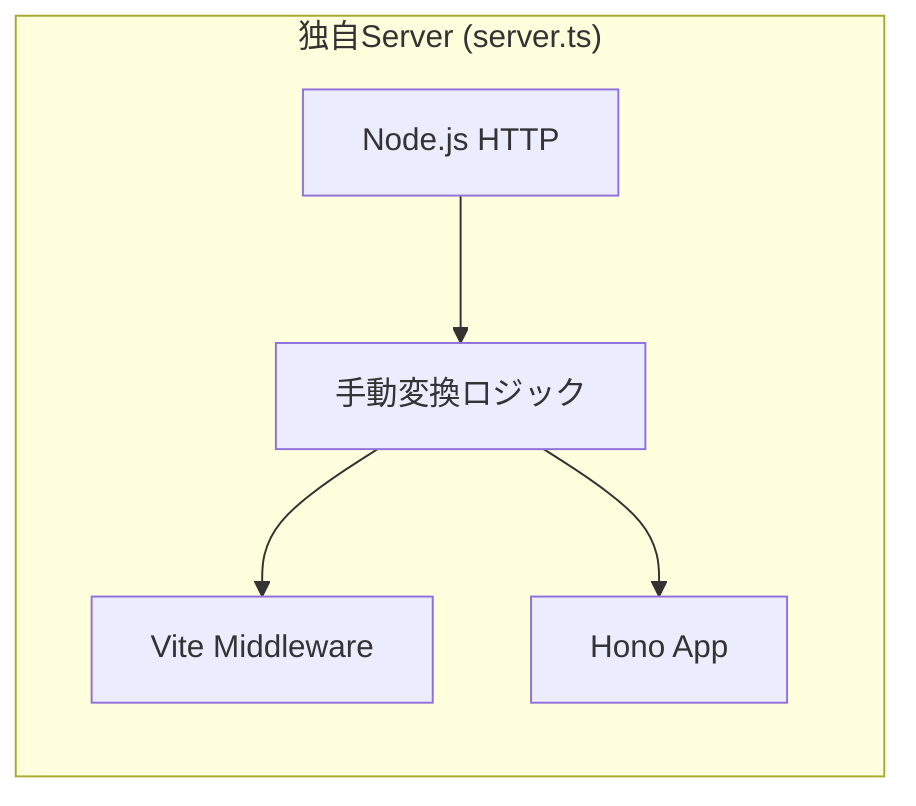
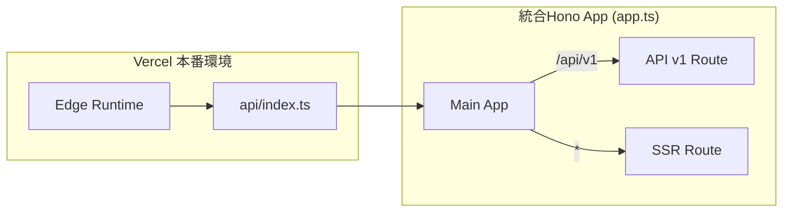

# 日次報告（2026-01-25）: SSRアーキテクチャの再構築

## 概要
SSR（Server-Side Rendering）アーキテクチャを Vercel および Hono の最新の標準プラクティスに従って再構築しました。これにより、複雑な独自実装が排除され、開発体験と本番環境のパフォーマンスが向上しました。

## 実施した主な変更

### 1. 開発環境の標準化
独自に `node:http` で Vite と Hono を繋いでいた `src/api/server.ts` を廃止し、公式の `@hono/vite-dev-server` を導入しました。これにより、`vite` コマンドだけでフロントエンド（HMR）とバックエンド（SSR/API）の両方が同期して動作するようになりました。

### 2. Vercel Edge Runtime への最適化
本番環境のエントリーポイント（`api/index.ts`）を `hono/vercel` ハンドラを用いた Edge Runtime 構成に変更しました。これにより、従来の Node.js Runtime よりも高速なレスポンスが期待できます。

### 4. API ルーティングの階層化
APIルートを `apiV1` インスタンスに集約し、`app.route("/api/v1", apiV1)` で一括管理するように変更しました。各エンドポイント定義から `/api/v1` の重複した記述を排除し、認知負荷をさらに低減しました。

## アーキテクチャ図（最新版）
より「基本形」に忠実な、階層化されたルーティング構成になっています。

### Before: 独自統合モデル
独自実装のサーバーが Vite と Hono を手動でブリッジしており、リクエスト/レスポンスの変換が必要で認知負荷が高い状態でした。

### After: Vercel/Hono 標準モデル（階層化ルーティング）
Vite が Hono をプラグインとして管理し、Vercel の規約にシームレスに適合する構成になりました。APIルートが階層化され、管理が容易になっています。

## 今後の展望
- **Edge 互換性の確認**: 依存ライブラリ（OpenAI SDK等）が Edge Runtime で完全に動作するか継続的に検証。
- **ビルドプロセスの統合**: `@hono/vite-build` を活用し、Vercel 向けのビルド成果物をさらに最適化。
- **キャッシュ戦略**: Edge Config や Redis を使ったサーバーサイドキャッシュの導入。
