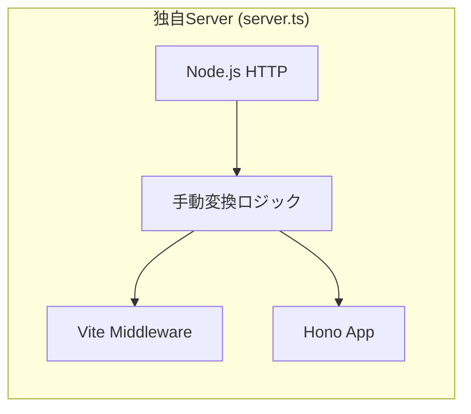

# 日次報告（2026-01-25）: SSRアーキテクチャの再構築

## 概要
SSR（Server-Side Rendering）アーキテクチャを Vercel および Hono の最新の標準プラクティスに従って再構築しました。これにより、複雑な独自実装が排除され、開発体験と本番環境のパフォーマンスが向上しました。

## 実施した主な変更

### 1. 開発環境の標準化
独自に `node:http` で Vite と Hono を繋いでいた `src/api/server.ts` を廃止し、公式の `@hono/vite-dev-server` を導入しました。これにより、`vite` コマンドだけでフロントエンド（HMR）とバックエンド（SSR/API）の両方が同期して動作するようになりました。

### 2. Vercel Edge Runtime への最適化
本番環境のエントリーポイント（`api/index.ts`）を `hono/vercel` ハンドラを用いた Edge Runtime 構成に変更しました。これにより、従来の Node.js Runtime よりも高速なレスポンスが期待できます。

### 3. アセット管理の自動化
`src/api/app.ts` 内で Vite の環境変数（`import.meta.env.PROD`）を判別し、開発用ソースと本番用ビルド成果物のアセットパスを自動的に切り替える仕組みを導入しました。

## アーキテクチャの変化

### Before: 独自統合モデル
独自実装のサーバーが Vite と Hono を手動でブリッジしており、リクエスト/レスポンスの変換が必要で認知負荷が高い状態でした。



### After: Vercel/Hono 標準モデル
Vite が Hono をプラグインとして管理し、Vercel の規約にシームレスに適合する構成になりました。

```mermaid
graph LR
    subgraph ViteEco["Vite エコシステム"]
        Vite[Vite Dev Server]
        HonoPlugin["@hono/vite-dev-server"]
        Hono[Hono App (app.ts)]
        
        Vite --> HonoPlugin
        HonoPlugin --> Hono
    end
    
    subgraph VercelEco["Vercel 本番環境"]
        Edge[Edge Runtime]
        VercelHandler[hono/vercel]
        HonoProd[Hono App (app.ts)]
        
        Edge --> VercelHandler
        VercelHandler --> HonoProd
    end
```

## 今後の展望
- **Edge 互換性の確認**: 依存ライブラリ（OpenAI SDK等）が Edge Runtime で完全に動作するか継続的に検証。
- **ビルドプロセスの統合**: `@hono/vite-build` を活用し、Vercel 向けのビルド成果物をさらに最適化。
- **キャッシュ戦略**: Edge Config や Redis を使ったサーバーサイドキャッシュの導入。
